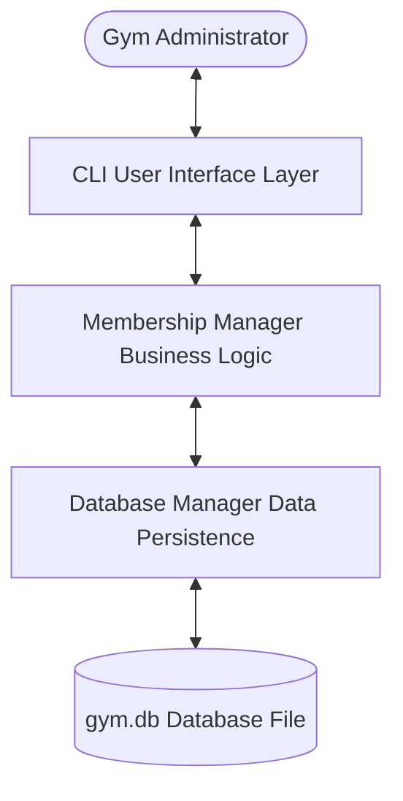
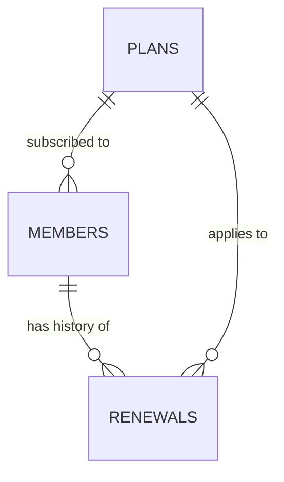
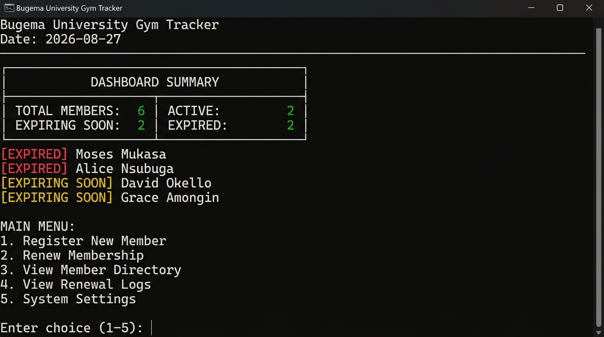
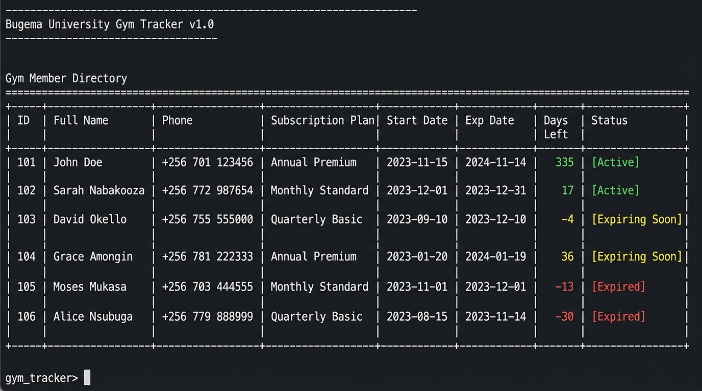
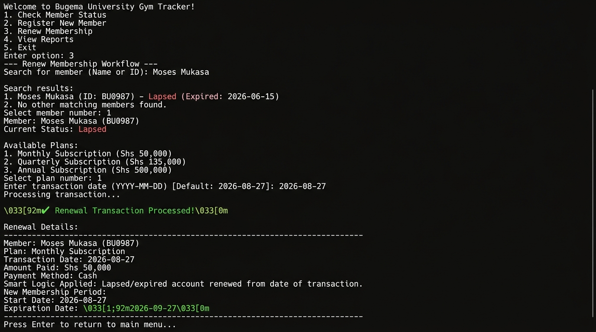

# Bugema University Gym Tracker - System Documentation

This document provides a comprehensive technical overview of the Gym Membership & Expiration Tracker system developed for Bugema University Gym. The system transitions the gym from manual paper-based logs to an automated, persistent database system.

---

## 1. System Architecture

The application is structured using a clean, layered architectural pattern written in modular Python:



### Layer Breakdown

1. **User Interface Layer (`GymCLI`)**:
   - Implements a text-based console menu system with input validation.
   - Leverages cross-platform ANSI escape sequences for formatting (bold, colors).
   - Generates responsive tables and real-time dashboard analytics.
2. **Business Logic Layer (`MembershipManager` & `DateHelper`)**:
   - Handles the core business rule calculations.
   - Calculates custom calendar month additions, coping with leap years and differing month lengths.
   - Governs the **Smart Renewal** transition rules.
   - Categorizes member account statuses dynamically.
3. **Data Persistence Layer (`DatabaseManager`)**:
   - Manages SQLite connection pooling using Python's `contextlib` to guarantee socket disposal and prevent Windows file locking.
   - Executes parameterized SQL queries preventing SQL injections.
   - Seeds initial lookup plans and test accounts.

---

## 2. Database Schema Layout

The database is built on a relational schema in SQLite (`gym.db`), structured to maintain complete referential integrity with cascading updates and deletions.



### 1. `plans` Table
Stores available subscription packages.

| Column | Data Type | Constraints | Description |
| :--- | :--- | :--- | :--- |
| `plan_id` | `INTEGER` | `PRIMARY KEY AUTOINCREMENT` | Unique identifier for each subscription plan. |
| `name` | `TEXT` | `UNIQUE NOT NULL` | Name of the plan (e.g., Monthly Subscription). |
| `duration_months` | `INTEGER` | `NOT NULL` | The plan duration in calendar months (1, 3, 6, 12). |
| `price` | `REAL` | `NOT NULL` | Cost of the plan in UGX. |

### 2. `members` Table
Stores active details and dates for gym members.

| Column | Data Type | Constraints | Description |
| :--- | :--- | :--- | :--- |
| `member_id` | `INTEGER` | `PRIMARY KEY AUTOINCREMENT` | Unique member registration number. |
| `full_name` | `TEXT` | `NOT NULL` | First and last name of the member. |
| `phone` | `TEXT` | `NOT NULL` | Member's validated contact number. |
| `email` | `TEXT` | `NULLABLE` | Optional validated email address. |
| `plan_id` | `INTEGER` | `NOT NULL`, `FOREIGN KEY` | Links to `plans(plan_id)`. |
| `start_date` | `TEXT` | `NOT NULL` | Subscription cycle start date (YYYY-MM-DD). |
| `expiration_date` | `TEXT` | `NOT NULL` | Calculated subscription expiration date (YYYY-MM-DD). |

### 3. `renewals` Table
An audit log tracking the billing and history of subscriptions.

| Column | Data Type | Constraints | Description |
| :--- | :--- | :--- | :--- |
| `renewal_id` | `INTEGER` | `PRIMARY KEY AUTOINCREMENT` | Unique log transaction receipt identifier. |
| `member_id` | `INTEGER` | `NOT NULL`, `FOREIGN KEY ON DELETE CASCADE` | References `members(member_id)`. |
| `plan_id` | `INTEGER` | `NOT NULL`, `FOREIGN KEY` | References `plans(plan_id)`. |
| `renewal_date` | `TEXT` | `NOT NULL` | The date the renewal payment was made (YYYY-MM-DD). |
| `old_expiration_date`| `TEXT` | `NULLABLE` | Expiry date before this renewal was processed. |
| `new_expiration_date`| `TEXT` | `NOT NULL` | Calculated new expiry date. |
| `amount_paid` | `REAL` | `NOT NULL` | The payment received (copied from plan price). |

---

## 3. Core Business Logic

### A. Date Calculations & Month Addition
Since Python's standard `datetime` module lacks calendar month additions, adding custom durations requires handling unequal month lengths (e.g., adding 1 month to January 31st must result in February 28th or 29th depending on leap year status).

We resolve this programmatically using:
```python
def add_months(source_date: date, months: int) -> date:
    month = source_date.month - 1 + months
    year = source_date.year + month // 12
    month = month % 12 + 1
    
    # Check for leap year
    is_leap = year % 4 == 0 and (year % 100 != 0 or year % 400 == 0)
    days_in_months = [31, 29 if is_leap else 28, 31, 30, 31, 30, 31, 31, 30, 31, 30, 31]
    
    day = min(source_date.day, days_in_months[month - 1])
    return date(year, month, day)
```

### B. Smart Renewal Logic
The system implements a robust account renewal policy, distinguishing between active extensions and lapsed reactivation:

* **Active Extension (Renewed before expiry)**:
  If $TransactionDate \le CurrentExpirationDate$, the member's new subscription period extends continuously from their old expiry date:
  $$NewStartDate = OldExpirationDate$$
  $$NewExpirationDate = OldExpirationDate + PlanDuration$$

* **Lapsed Reactivation (Renewed after expiry)**:
  If $TransactionDate > CurrentExpirationDate$, the new cycle starts immediately on the transaction date:
  $$NewStartDate = TransactionDate$$
  $$NewExpirationDate = TransactionDate + PlanDuration$$

```python
if renewal_date <= old_expiration_date:
    new_start_date = old_expiration_date
else:
    new_start_date = renewal_date
```

### C. Expiration Classification (Status Tracking)
Member accounts are categorized dynamically by evaluating the remaining calendar days between the system date and the expiration date:

- **Expired**: $DaysRemaining < 0$
- **Expiring Soon**: $0 \le DaysRemaining \le Threshold$ (Threshold defaults to 7 days)
- **Active**: $DaysRemaining > Threshold$

This classification is performed dynamically at runtime, avoiding out-of-sync status values in database rows.

---

## 4. Application Screenshots

### System Dashboard
The home screen display showing the system date, total stats counts, and alerts highlighting members who have already expired or are expiring soon:



### Gym Member Directory
The structured ASCII-drawn grid showing columns for name, phone, dates, days remaining, and color-coded status labels:



### Membership Renewal Flow
A test run displaying the selection of a lapsed member (Moses Mukasa), renewing him on a Monthly plan, and displaying the successful renewal banner along with details of the applied smart logic:


